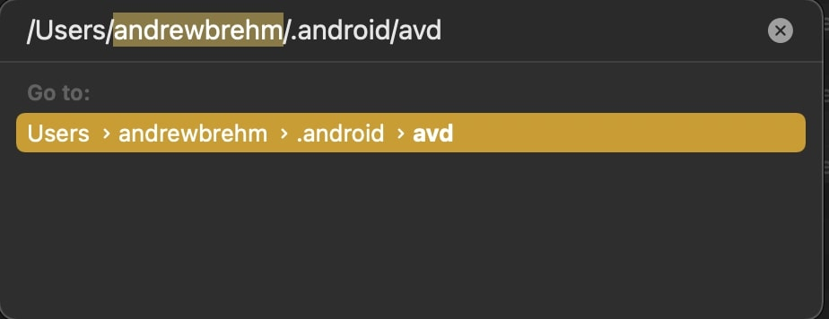
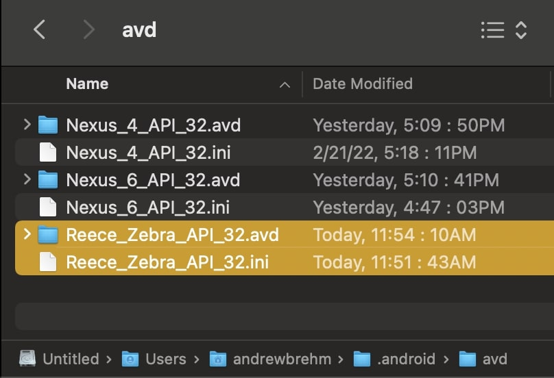
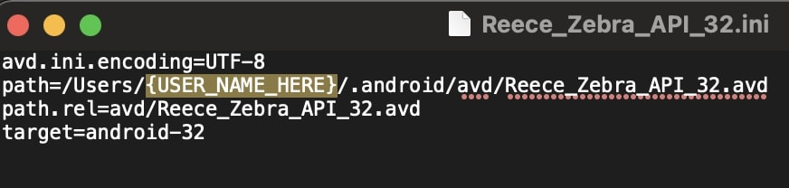
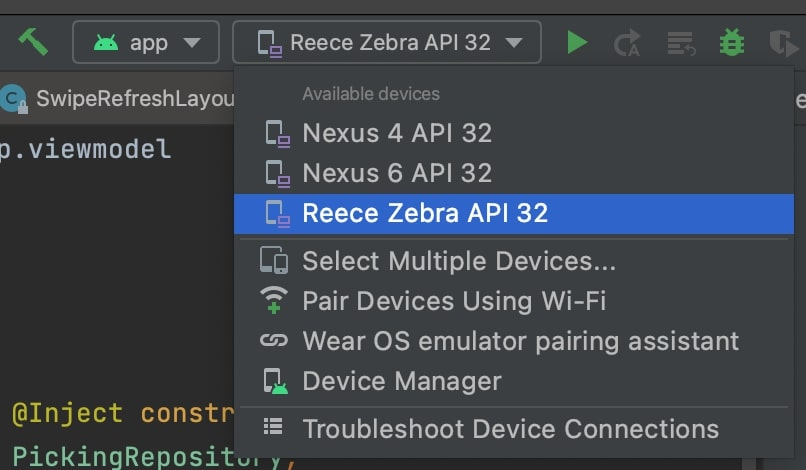

# DialexaAndroidEmulators
## PURPOSE
* A collection of Emulators that are project specific

## INSTALLATION
* Navigate to the directory where AVD emulators are stored
  * On Mac: Finder > Go > Go to folder
  * Navigate to avd directory `/Users/{USER_NAME_HERE}/.android/avd`
  * 
* Open the directory of the emulator to use.
* Copy the `.avd` and `.ini` files and place them in the `/Users/{USER_NAME_HERE}/.android/avd` directory you just opened
  * 
* Open the `.ini` file and replace the path `{USER_NAME_HERE}` with your device username
  * 
* Restart Android Studio and new emulator is in the dropdown
  * 
