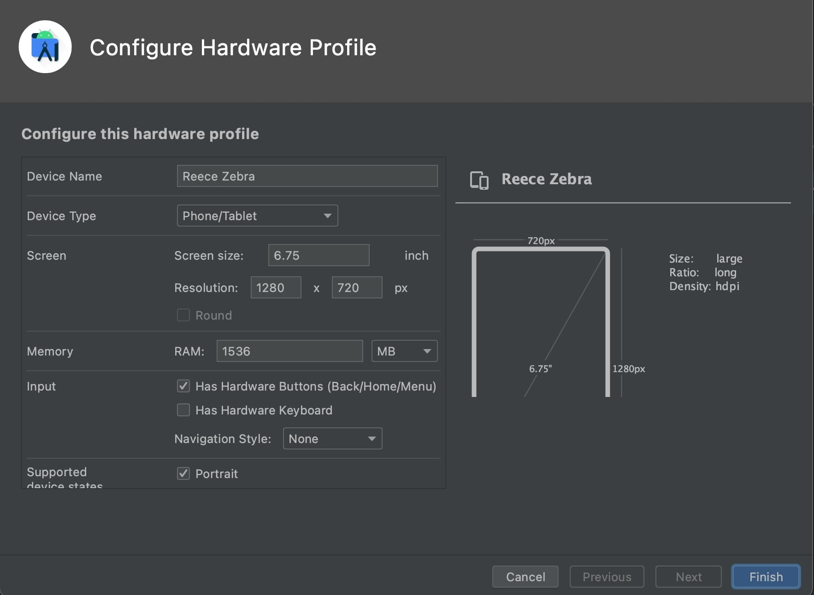

# DialexaAndroidEmulators
## PURPOSE
* A collection of Emulators that are project specific

## INSTALLATION
* Navigate to the directory where AVD emulators are stored
  * On Mac: Finder > Go > Go to folder
  * Navigate to avd directory `/Users/{USER_NAME_HERE}/.android/avd`
  * 
* Open the directory of the emulator to use.
* Copy the `.avd` and `.ini` files and place them in the `/Users/{USER_NAME_HERE}/.android/avd` directory you just opened
  * 
* Open the `.ini` file and replace the path `{USER_NAME_HERE}` with your device username
  * 
* Restart Android Studio and new emulator is in the dropdown
  * 

## HOW ARE SCREEN SIZES CALCULATED?
* Taking the screen dimensions from spec documentation
  * Reece [Zebra](documentation/Reece/TC52-TC57-specification-sheet.pdf)
* Using a [Screen Size Calculator](https://www.omnicalculator.com/other/screen-size) dimensions are entered to get full screen data.
* That info is entered into the Android Studio Configure Hardware Profile wizard
  * 
